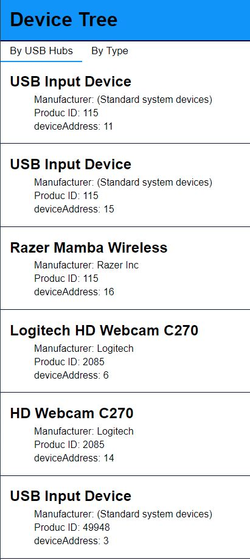

# Device Tree

## Description

Client + Server solution that presents a live (with updates of connected and disconnected devices) tree of the devices connected via USB to the server's machine.
Build with @MCE lib: reflow.

## Technology Wise

Technologies used in this project:

- Reflow
- Axios (Rest API)
- Node.js
- Express.js
- usb-detections
- ws (sockets)

## Getting Started

These instructions will get you a copy of the project and running on your local machine for development and testing purposes.

- run `git clone https://github.com/IlyaKad/device-tree-reflow-TS.git`

  or

- download zip folder

  - open Command Prompt
    - `cd device-tree-server`
    - `npm run initServer`
  - open new Command Prompt
    - `cd device-tree-client`
    - `npm run initClient`
    - then go to http://localhost:8080/

## App screenshots

